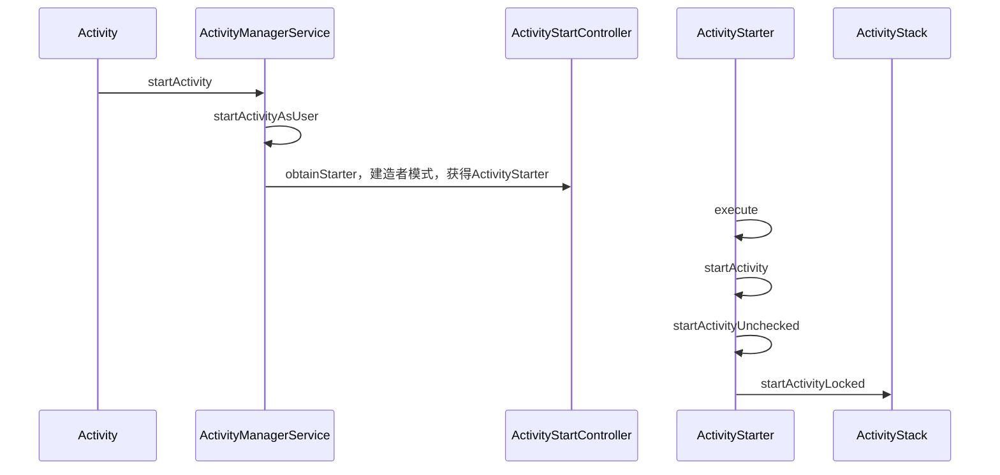
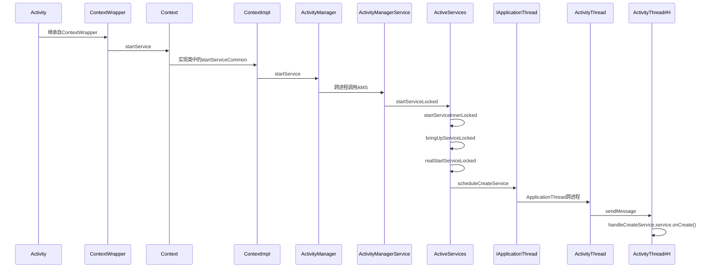
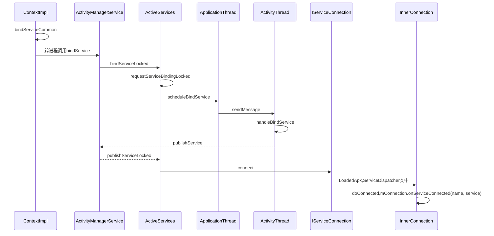

# 读Android开发艺术探索

## 第5章 理解RemoteViews

### `RemoteViews`的应用

## 第9章 四大组件的工作过程

### Activity的工作过程

#### startActivity

> 调用了startActivityForResult,通过Instrumentaion来尝试启动Activity，这是一个跨进程的过程，它会调用ams的startActivity方法，当ams校验完Activity的合法性之后，会通过
> ApplicationThread回调到我们的进程，这也是一次跨进程过程，而ApplicationThread就是一个Binder。回调逻辑是在Binder线程池中完成，所以需要通过Handler切换回UI线程，第一个消息是
> LAUNCH_ACTIVITY，它对应着方法handleLaunchActivity，在这个方法里面完成了Activity的创建和启动。接着，在Activity的onResume中，Activity的内容开始渲染到Window上面，然后开始
> 绘制直到我们可以看见

### Service的工作过程

#### Service的启动过程

> `Activity`中的`startService`实际上最终会调用到`ContextImpl`的`startServiceCommon`，它会跨进程调用`ActivityManagerService`中的`startServiceLocked`，然后调用其中的辅助类`ActiveService`的一系列方法，之后通过`ApplicationThread`回调到我们的进程（`ActivityThread`中的一个子类），`ApplicationThread`是一个`binder`，运行在`binder`线程池中，但是`Service`是运行在UI线程的，这是因为`ApplicationThread`会使用`ActivityThread`中的H（这个`H`是主线程的`handler`）发送消息，然后在`H`的`handleMessage`（也就是主线程）中执行`handleStartService`方法，最终回调`service`中的`onCreate`方法

#### Service的绑定过程 

